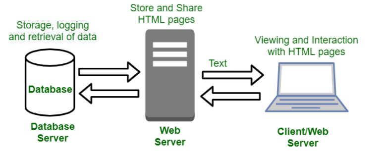

# Understanding Client & Server

- Client

The device in front of you. 
Runds some kind of web browser

+ Web brower

Software that runs on the client that displays web pages. (chrome, firefox, opera)

- Server

Where your public websites lives
Hardware server: the physical computer that serves up web pages.
Software server: The program that run to serve up the web pages (apache). 

